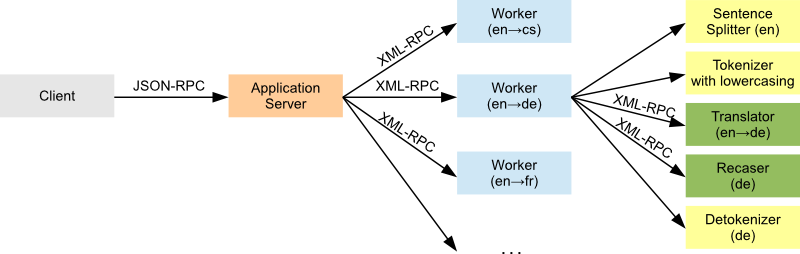

MTMonkey – an infrastructure for Machine Translation web services
=================================================================

Description
-----------

MTMonkey is a simple and easily adaptable infrastructure for 
Machine Translation web services, written in Python.
It allows clients JSON-encoded request for different translation directions
to be distributed among multiple MT servers.

This system consists of:

* the main **application server** that handles the clients' requests and
  distributes them to the machines that perform the translation,
* the **worker** that handles one translation direction (including 
  segmentation, tokenization, recasing, and detokenization),
* all **text processing tools** used by the workers,
* a simple demonstration **web client** written in PHP,
* and **support scripts** for self-checks, auto-starting and easy model
  distribution.

The communication between the main application server and workers proceeds
via XML-RPC requests, but workers accepting JSON requests are also supported
on the application server side, allowing alternative worker implementations.

There may be more workers for the same language pair. Workers may
run on the same physical machine or on several different machines.
For a more detailed description of the overall architecture of MTMonkey,
see [our paper presented at MT Marathon 2013](http://ufal.mff.cuni.cz/pbml/100/art-tamchyna-dusek-rosa-pecina.pdf)
in Prague or the [accompanying poster](http://ufal.mff.cuni.cz/~odusek/papers/2013_mtmonkey_poster.pdf).

License
-------

Authors: Aleš Tamchyna, Ondřej Dušek, Rudolf Rosa, Pavel Pecina

Copyright © 2013 Institute of Formal and Applied Linguistics,
   Charles University in Prague.

Licensed under the Apache License, Version 2.0.

When using this software in your scientific work, please cite the
following paper: 

Aleš Tamchyna, Ondřej Dušek, Rudolf Rosa, and Pavel Pecina:
**MTMonkey: A scalable infrastructure for a Machine Translation web service**.
In *Prague Bulletin of Mathematical Linguistics* 100, 2013, pp. 31-40.

* [Paper PDF](http://ufal.mff.cuni.cz/pbml/100/art-tamchyna-dusek-rosa-pecina.pdf)
* [Poster PDF](http://ufal.mff.cuni.cz/~odusek/papers/2013_mtmonkey_poster.pdf)

Contents of this package
------------------------

* `appserver` – source codes of the application server
* `cmdline-client` – command-line clients for MTMonkey
* `config-example` – example configuration files
* `images` – just logos and images
* `install` – installation scripts and instructions
* `scripts` – application server, worker and Moses servers startup scripts
* `web-client` – two different web clients for the service
* `worker` – source codes of the worker, incl. text pre- and post-processing
             tools.

Usage
-----

### Installation ###

For installation notes for both workers and the application
server, see [install/README.md](install/README.md).

### API description ###

For a detailed description of the API used by MTMonkey,
see [API.md](API.md) and the paper referenced above.

### MTMonkey clients ###

The package includes [command-line](cmdline-client) and [web-based](web-client)
clients that can connect to MTMonkey servers. Please see the respective
directories for documentation.

In addition, you can easily send requests to MTMonkey from command-line
using the `curl` tool, or from your browser by typing the correct URL.
See the [API description](API.md#testing-from-the-command-line--browser-window) for more information.

***

Acknowledgements
----------------

The research leading to these results has received funding from the European Union Seventh 
Framework Programme (FP7/2007-2013) under grant agreement n° 257528 (KHRESMOI). 
This work has been using language resources developed and/or stored and/or distributed 
by the LINDAT-Clarin project of the Ministry of Education of the Czech Republic 
(project LM2010013). This work has been supported by the AMALACH grant (DF12P01OVV02) of 
the Ministry of Culture of the Czech Republic.

